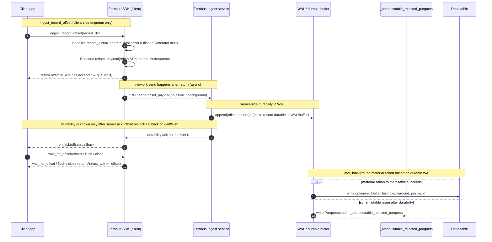

# zerobusdemo

Demo and helper code for **Databricks ZeroBus Ingest** — stream Protobuf-serialized rows
directly into Unity Catalog Delta tables without Kafka, brokers, or partition management.

## What's in this repo

| Path | Purpose |
|------|---------|
| `src/zbhelper/` | Python helpers: ZeroBus ingest, Protobuf converter, workspace info |
| `src/statschema/` | DDL/stats transpiler (bundled; will move to PyPI as `statschema`) |
| `notebooks/zerobus_grpc_async.ipynb`, `zerobus_grpc_sync.ipynb`, `zerobus_http_sync.ipynb` | Zerobus doc-style demos (gRPC async/sync, HTTP REST) |
| `docs/faq/` | ZeroBus FAQ (authentication, serialization, throughput, limits, …) |
| `zerobus-sdk/python/` | ZeroBus Python SDK source |
| `databricks.yml` | Databricks asset bundle config |

## Quick start

```bash
# 1. Create a virtual environment
make venv

# 2. Configure Databricks credentials
databricks auth login --configure-serverless

# 3. Run unit tests (no credentials needed)
make test-unit

# 4. Run integration test against a live workspace
export ZEROBUS_TABLE_NAME=main.my_schema.my_table
make test-integration
```

## Core API

```python
from src.zbhelper import IngestConfig, ingest_dataframe
from src.statschema import parse_ddl

# Parse schema from any dialect
tables = parse_ddl("CREATE TABLE orders (id INT, amount DECIMAL(10,2))", dialect="mysql")

# Build config (uses ~/.databrickscfg automatically)
config = IngestConfig.from_workspace_client(table_name="main.default.orders")

# Stream a Spark DataFrame into ZeroBus
result = ingest_dataframe(df, tables[0], config)
print(f"Sent {result.rows_sent} rows in {result.batch_count} batches")
```

## Authentication

Two modes are supported:

**SDK auth (local dev)** — uses `~/.databrickscfg`, same credentials as Databricks Connect:
```python
config = IngestConfig.from_workspace_client(table_name="main.default.t")
```

**Service principal (CI/production)** — requires env vars:
```bash
export DATABRICKS_CLIENT_ID=...
export DATABRICKS_CLIENT_SECRET=...
export ZEROBUS_SERVER_ENDPOINT=https://...
export DATABRICKS_WORKSPACE_URL=https://...
export ZEROBUS_TABLE_NAME=main.schema.table
```
```python
config = IngestConfig.from_env()
```

## Sequence Diagram


## FAQ

See [`docs/faq/`](docs/faq/) for answers to common questions:

- [What is ZeroBus Ingest?](docs/faq/01-what-is-zerobus.md)
- [Authentication modes](docs/faq/05-authentication.md)
- [Serialization formats](docs/faq/06-serialization-formats.md)
- [Throughput and latency](docs/faq/07-throughput-latency.md)
- [Key limitations](docs/faq/12-key-limitations.md)
- [Find your workspace region](docs/faq/15-find-workspace-region.md)

## Dependency note

`src/statschema/` is bundled here for convenience until the
[statschema](https://github.com/robert-lee/statschema) package is published to PyPI.
Once available, replace it with `pip install statschema` and update imports accordingly.
